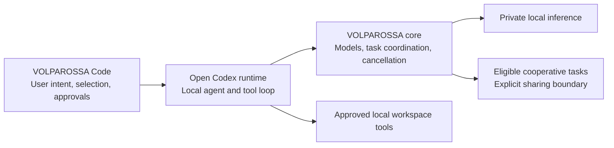

# Project VOLPAROSSA Code

**An open editor companion for the VOLPAROSSA cooperative network.**

The destination is a coding assistant built on the **open Codex CLI/app-server**,
with VOLPAROSSA supplying intelligence and organizing collaboration. This is an
independent GPL-3.0-only extension for VS Code/VSCodium—not a repackaged copy of
OpenAI's proprietary IDE extension, and not an OpenAI-backed service.

## Who does what?



This diagram describes the **target integration**, not an already completed
coding datapath. The core owns peer selection and cooperation; the editor must
not create a separate peer scheduler or treat model output as permission to run
commands. Private prompts, code, tool output and repository history are not
automatically public training or cache material.

## First executable slice

The extension implements explicit commands:

- **VOLPAROSSA: Ask About Selected Code (Private, Local)** sends only a confirmed
  question and selection to an existing same-owner `compute private-serve` socket.
  Responses appear as untrusted plaintext; no changes are applied automatically.
- **VOLPAROSSA: Show Compute Capabilities** queries that service without sending
  code or claiming that a model has successfully executed.
- **VOLPAROSSA: Run Native Coding Task (Private, Local)** explicitly launches a
  prepared, source-verified open Codex runtime in an isolated Linux workspace and
  connects it to the existing local VOLPAROSSA conversation service. The native
  agent can read, change and check that selected project, with one-shot command
  approvals and cancellation. See [setup and current proof limits](docs/NATIVE_EDITOR.md).

The selected-code advice interface permits **512 UTF-8 bytes for the question and 4096
for the selection**, subject to the selected model's smaller token budget.
Over-limit inputs fail instead of being silently shortened. Partial model output
remains labeled partial. Cancellation is forwarded; uncertain cleanup is not
reported as success. There is no public-peer or OpenAI fallback.

The first two commands use the core directly, not through Codex. The new native
coding command uses the app-server, but is **not yet proved in a native editor
with real model-driven editing**. The app-server client implements the pinned NDJSON handshake,
thread/turn requests, notifications and interruption, and declines tool approvals
by default. An explicit caller can supply a narrowly scoped per-command approval
policy; only the explicit native coding command enables an interactive one-shot
policy for the selected project. Its focused protocol tests are
now complemented by a **real, source-built app-server lifecycle trial**:
initialization, an ephemeral VOLPAROSSA-provider thread, exact unsubscribe and
clean shutdown pass in disposable namespaces without OpenAI credentials or
network access. This trial does not send a model turn or execute tools.

Separately, the [real core/model trial](https://github.com/VOLPAROSSA/volparossa/actions/runs/36738995292)
passes with this repository's pinned private client and the 360M model: a small
synthetic-code question produces a complete answer containing its identifier,
with cancellation, isolation and cleanup checks. This is an adapter proof, not
a native-editor test or a measure of general coding quality.

See the [explicit runtime build and native trial](docs/RUNTIME_BUILD.md). Nothing
is downloaded or started merely by installing or activating the extension.

The next [local Responses adapter](docs/RESPONSES_PROVIDER.md) now connects a
bounded text/tool subset to the core's separate conversation interface. It retains
call/result identities and waits for confirmed core cleanup before returning a
completed turn. Its real HTTP/Unix-socket tests use synthetic model responses;
the actual Codex/model/tool loop is **not proved yet**. The new Qwen conversation
profile is a larger-context candidate, not evidence of reliable coding performance.

An explicit [native coding trial](docs/NATIVE_CODING_TRIAL.md) now supplies the
missing model catalog and disposable read/edit/test harness. It uses the full
pinned Codex prompt, actual core inference and native tools, with approvals limited
to one synthetic project. The harness is implemented and its offline checks pass;
the actual model-driven coding trial is still pending.

## Try the development extension

On Linux, explicitly prepare and start the core's private service following its
[IPC contract](https://github.com/VOLPAROSSA/volparossa/blob/main/crates/volparossa/src/compute/private_serve/WIRE.md).
The extension does not install runtimes/models, start participation, change
network settings or read your existing Codex credentials/configuration.

Open this repository as an **extension development directory** in VS Code or
VSCodium. In the development instance's user settings, set
`volparossaCode.privateSocket` to the service's absolute Unix-socket path. Use a
trusted, local workspace, select a short snippet, then invoke the command from
the command palette. No npm dependencies are required. Do not treat this as a
packaged or native-editor-tested release yet.

With Node 22 or newer, the focused checks are:

```sh
npm test
npm run check
```

## Remaining integration work

- Prove the new conversation/provider interface with an actual model and the
  native Codex Responses/tool loop; the bounded Q&A endpoint stays separate.
- Prove the new explicit runtime/extension/provider connection in a native editor,
  retaining its isolated configuration and upstream notices; never use the
  owner's OpenAI login or cloud fallback.
- Complete native conversation/tool interoperability, reviewable diffs and local
  approvals, then prove an actual edit-and-test coding task end to end.
- Delegate eligible work through the core's cooperative scheduler, with explicit
  privacy scope, cancellation, resource accounting and result provenance.
- Run a native editor test against a real core/model and package the extension.

The small models currently supported by the core are not a claim of Codex-class
coding performance. Installing this frontend alone does not supply a stronger
model, private distributed inference or a completed cooperative coding agent.

See [upstream provenance](THIRD_PARTY_LICENSES.md), the
[open Codex app-server documentation](https://learn.chatgpt.com/docs/app-server)
and the [open-source boundary](https://learn.chatgpt.com/docs/open-source).
