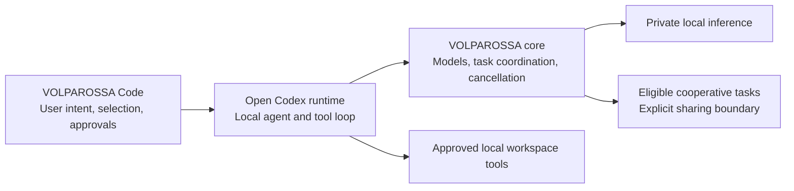

# Project VOLPAROSSA Code

**An open editor companion for the VOLPAROSSA cooperative network.**

The destination is a coding assistant built on the **open Codex CLI/app-server**,
with VOLPAROSSA supplying intelligence and organizing collaboration. This is an
independent GPL-3.0-only extension for VS Code/VSCodium—not a repackaged copy of
OpenAI's proprietary IDE extension, and not an OpenAI-backed service.

## Who does what?



This diagram describes the **target integration**, not an already completed
coding datapath. The core owns peer selection and cooperation; the editor must
not create a separate peer scheduler or treat model output as permission to run
commands. Private prompts, code, tool output and repository history are not
automatically public training or cache material.

## First executable slice

The extension implements two explicit commands:

- **VOLPAROSSA: Ask About Selected Code (Private, Local)** sends only a confirmed
  question and selection to an existing same-owner `compute private-serve` socket.
  Responses appear as untrusted plaintext; no changes are applied automatically.
- **VOLPAROSSA: Show Compute Capabilities** queries that service without sending
  code or claiming that a model has successfully executed.

The current core interface permits **512 UTF-8 bytes for the question and 4096
for the selection**, subject to the selected model's smaller token budget.
Over-limit inputs fail instead of being silently shortened. Partial model output
remains labeled partial. Cancellation is forwarded; uncertain cleanup is not
reported as success. There is no public-peer or OpenAI fallback.

These first commands use the core directly. They are **not yet routed through
Codex**. The separate app-server client implements the pinned NDJSON handshake,
thread/turn requests, notifications and interruption, and declines tool approvals
until an interactive approval layer is connected. Its tests use a protocol
fixture, not a running Codex binary.

## Try the development extension

On Linux, explicitly prepare and start the core's private service following its
[IPC contract](https://github.com/VOLPAROSSA/volparossa/blob/main/crates/volparossa/src/compute/private_serve/WIRE.md).
The extension does not install runtimes/models, start participation, change
network settings or read your existing Codex credentials/configuration.

Open this repository as an **extension development directory** in VS Code or
VSCodium. In the development instance's user settings, set
`volparossaCode.privateSocket` to the service's absolute Unix-socket path. Use a
trusted, local workspace, select a short snippet, then invoke the command from
the command palette. No npm dependencies are required. Do not treat this as a
packaged or native-editor-tested release yet.

With Node 22 or newer, the focused checks are:

```sh
npm test
npm run check
```

## Remaining integration work

- Connect a genuine VOLPAROSSA coding-model/provider interface to the Codex
  Responses/tool loop; the current bounded Q&A endpoint is not that interface.
- Prepare the exact open runtime with preserved upstream notices and an isolated
  configuration, without using the owner's OpenAI login or cloud fallback.
- Add conversation/context support, typed tool calls, reviewable diffs and local
  approvals, then prove an actual edit-and-test coding task end to end.
- Delegate eligible work through the core's cooperative scheduler, with explicit
  privacy scope, cancellation, resource accounting and result provenance.
- Run a native editor test against a real core/model and package the extension.

The small models currently supported by the core are not a claim of Codex-class
coding performance. Installing this frontend alone does not supply a stronger
model, private distributed inference or a completed cooperative coding agent.

See [upstream provenance](THIRD_PARTY_LICENSES.md), the
[open Codex app-server documentation](https://learn.chatgpt.com/docs/app-server)
and the [open-source boundary](https://learn.chatgpt.com/docs/open-source).
