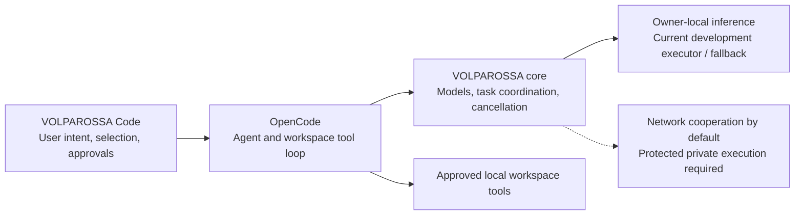

# Project VOLPAROSSA Code

**An open editor companion for the VOLPAROSSA cooperative network.**

The selected direction is a coding assistant built on **OpenCode**, with
VOLPAROSSA supplying intelligence and organizing network cooperation. Reusing
suitable upstream apps, clients and editor integrations is part of that direction.
Original integration code is GPL-3.0-only; upstream licenses and notices remain
intact. This is not an OpenAI-backed service or a copy of its proprietary IDE extension.

**What is on `main`?** The executable baseline below still contains the earlier
Codex-based experiments and direct private-core commands. The OpenCode runtime
and cooperative-tool integration are being developed in
[PR #5](https://github.com/VOLPAROSSA/volparossa-code/pull/5), which has not yet
been merged. This README update does not install that runtime or change the
working commands on `main`.

## Who does what?



This diagram describes the **target integration**, not an already completed
coding datapath. The core owns peer selection and cooperation; the editor must
not create a separate peer scheduler or treat model output as permission to run
commands. Private prompts, code, tool output and repository history are not
automatically public training or cache material.

Cooperation is the default architectural goal, not an optional replacement for
an otherwise local-only product. Private work must also be able to use suitable
network executors without exposing source or tool data to their operators. That
protected execution is **not implemented by the current local executor**: TLS,
task fragmentation and peer signatures alone do not hide inputs from an ordinary
executing host. Explicitly public task sharing is a separate capability, not proof
of private distributed coding.

## First executable slice — current `main`

The extension implements two explicit commands:

- **VOLPAROSSA: Ask About Selected Code (Private, Local)** sends only a confirmed
  question and selection to an existing same-owner `compute private-serve` socket.
  Responses appear as untrusted plaintext; no changes are applied automatically.
- **VOLPAROSSA: Show Compute Capabilities** queries that service without sending
  code or claiming that a model has successfully executed.

The current core interface permits **512 UTF-8 bytes for the question and 4096
for the selection**, subject to the selected model's smaller token budget.
Over-limit inputs fail instead of being silently shortened. Partial model output
remains labeled partial. Cancellation is forwarded; uncertain cleanup is not
reported as success. There is no public-peer or OpenAI fallback.

These first commands use the core directly. They are **not yet routed through
Codex**. The separate app-server client implements the pinned NDJSON handshake,
thread/turn requests, notifications and interruption, and declines tool approvals
by default. An explicit caller can supply a narrowly scoped per-command approval
policy; the normal extension does not enable it. Its focused protocol tests are
now complemented by a **real, source-built app-server lifecycle trial**:
initialization, an ephemeral VOLPAROSSA-provider thread, exact unsubscribe and
clean shutdown pass in disposable namespaces without OpenAI credentials or
network access. This trial does not send a model turn or execute tools.

Separately, the [real core/model trial](https://github.com/VOLPAROSSA/volparossa/actions/runs/36738995292)
passes with this repository's pinned private client and the 360M model: a small
synthetic-code question produces a complete answer containing its identifier,
with cancellation, isolation and cleanup checks. This is an adapter proof, not
a native-editor test or a measure of general coding quality.

See the [explicit runtime build and native trial](docs/RUNTIME_BUILD.md). Nothing
is downloaded or started merely by installing or activating the extension.

The next [local Responses adapter](docs/RESPONSES_PROVIDER.md) now connects a
bounded text/tool subset to the core's separate conversation interface. It retains
call/result identities and waits for confirmed core cleanup before returning a
completed turn. Its real HTTP/Unix-socket tests use synthetic model responses;
the actual Codex/model/tool loop is **not proved yet**. The new Qwen conversation
profile is a larger-context candidate, not evidence of reliable coding performance.

An explicit [native coding trial](docs/NATIVE_CODING_TRIAL.md) now supplies the
missing model catalog and disposable read/edit/test harness. It uses the full
pinned Codex prompt, actual core inference and native tools, with approvals limited
to one synthetic project. The harness is implemented and its offline checks pass;
the actual model-driven coding trial is still pending.

## Try the development extension

On Linux, explicitly prepare and start the core's private service following its
[IPC contract](https://github.com/VOLPAROSSA/volparossa/blob/main/crates/volparossa/src/compute/private_serve/WIRE.md).
The extension does not install runtimes/models, start participation, change
network settings or read your existing Codex credentials/configuration.

Open this repository as an **extension development directory** in VS Code or
VSCodium. In the development instance's user settings, set
`volparossaCode.privateSocket` to the service's absolute Unix-socket path. Use a
trusted, local workspace, select a short snippet, then invoke the command from
the command palette. No npm dependencies are required. Do not treat this as a
packaged or native-editor-tested release yet.

With Node 22 or newer, the focused checks are:

```sh
npm test
npm run check
```

## Remaining integration work

- Integrate the OpenCode candidate into `main`, preserving isolated configuration,
  upstream notices and the existing private Q&A command. Retain the Codex evidence
  as history, not as the selected future runtime.
- Prove an actual OpenCode/model read-edit-test task with reviewable changes,
  explicit local approvals and independently checked results. Protocol tests or
  synthetic replies alone do not prove real model-driven coding.
- Make network cooperation standard through the core's scheduler, with protected
  private execution, resource accounting, cancellation, result provenance and
  core immune-policy oversight; do not substitute public sharing for private execution.
- Run native editor tests against the real core/model and prepare suitable upstream
  app/client integrations and packaging.

The small models currently supported by the core are not a claim of Codex-class
coding performance. Installing this frontend alone does not supply a stronger
model, private distributed inference or a completed cooperative coding agent.

See [upstream provenance for the current baseline](THIRD_PARTY_LICENSES.md) and
the [OpenCode migration PR](https://github.com/VOLPAROSSA/volparossa-code/pull/5).
The [Codex app-server documentation](https://learn.chatgpt.com/docs/app-server)
and [open-source boundary](https://learn.chatgpt.com/docs/open-source) describe the
historical foundation retained on `main`, not the newly selected runtime.
