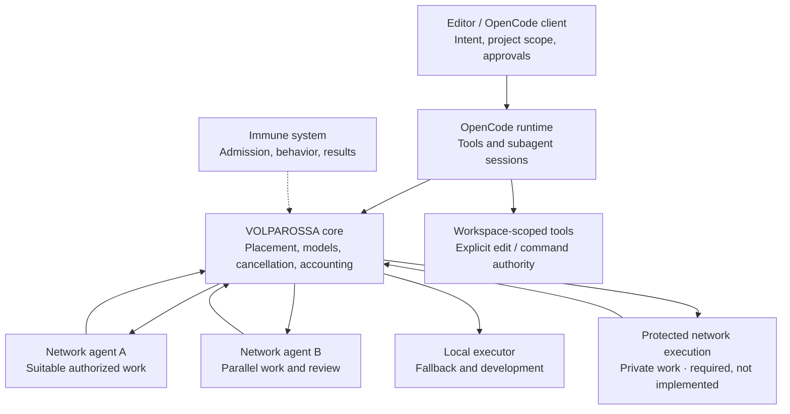

# Project VOLPAROSSA Code

**OpenCode tools. VOLPAROSSA intelligence. Cooperative development.**

VOLPAROSSA Code connects the open-source **OpenCode** coding runtime to the
VOLPAROSSA core. The goal is a network-native assistant that can read, change
and check code, distribute useful work, combine agent results and improve its
working methods—without making the power of one device the limit.

OpenCode replaces the earlier Codex CLI/app-server foundation. Suitable upstream
apps, clients and editor integrations can share the same core connection. The
first integration is a development extension for VS Code/VSCodium on Linux;
cross-platform applications and packaging are not yet complete.

## One coordinator, multiple cooperating agents



This is the **target architecture**, not a claim that every arrow works today.
Network cooperation and collective improvement are the default design, including
private projects. Core owns peer scheduling; OpenCode's local subagents do not
themselves provide a decentralized network or confidential remote execution.

Privacy belongs inside cooperation. Encrypted transport and task splitting alone
do not hide code from the device doing ordinary inference. Code, prompts, tool
output and history are not automatically public cache or training data. A local-only
assistant does not fulfill the goal of the shared VOLPAROSSA brain.

## Current executable integration

**VOLPAROSSA: Run OpenCode Task (Development)** selects the new OpenCode launcher,
not Codex. It joins these implemented components:

- Pinned OpenCode **v1.18.34**, authenticated HTTP sessions and SSE events.
- A Chat Completions provider translating text and function-tool history into
  the core's typed conversation interface.
- One-shot command/edit approvals, correlated root and child sessions,
  cancellation, session deletion and owned-process cleanup.
- An explicit Linux launcher with a selected writable project, temporary state,
  no inherited account credentials and no external network interface.

**Current proof:** the pinned OpenCode source builds and the actual runtime
completes a tool loop through the production launcher and adapters: one approved
command changes a disposable file, its tool result returns to the core interface,
and the session shuts down cleanly. A second native trial invokes the cooperative
tool, preserves complete and incomplete core results, and confirms that only the
enrolled public snapshot crosses the bridge. Both trials use **synthetic core/model
replies**, not real inference or peer execution. Focused checks additionally cover
adapter, editor and lifecycle behavior. Model-driven coding, native editor UI
operation, protected peer execution and a finished immune-policy path remain unproved.

The available conversation executor is still **private and local**. Its scope is
shown honestly; the adapter does not disguise it as network compute or export
private input through the public peer interface.

**VOLPAROSSA: Run OpenCode Task with Enrolled Public Work** additionally connects
one explicitly reviewed public question and selected excerpt to the core's
cooperative task interface. The model can invoke this task once; it cannot append
private files or history to it. A limited owner-side proxy keeps the raw public
core socket outside the coding sandbox. Core owns peer placement, execution and
cancellation; original task results and incomplete-answer flags are retained.
This interface currently requires the separate core cooperative-compute candidate,
not stock `main`. The joined path with actual peer inference remains to be proved.

This public-only development step is **not** the intended limit of cooperation:
default collaboration, shared learning and protected private execution across
the network remain required functionality.

The existing **Ask About Selected Code (Private, Local)** and **Show Compute
Capabilities** commands remain available. Selected-code advice sends only the
confirmed question and excerpt to the same-owner core socket. It does not change
files or execute tools.

## Development setup

See [OpenCode setup, isolation and proof boundaries](docs/OPENCODE.md).
Use a trusted local workspace and explicitly provision the pinned runtime and
core/model service. Opening the extension or a project starts no model, runtime
or network participation. No OpenAI login or automatic cloud fallback is used.

Run focused checks with Node 22 or newer:

```sh
node --test tests/opencode-*.test.cjs tests/cooperative-*.test.cjs tests/chat-completions-provider.test.cjs tests/extension.test.cjs
```

Original integration code is GPL-3.0-only. OpenCode is MIT-licensed; its original
notice and source pin are preserved in [third-party provenance](THIRD_PARTY_LICENSES.md).

## Remaining work

- Exercise the source-built OpenCode runtime with actual core inference and a
  model-driven read/edit/test task, then verify native editor operation.
- Prove the connected cooperative tool with actual core/peer execution, then
  integrate its core dependency; retain original results, cancellation and provenance.
- Implement remote conversation execution and actual protected private work,
  with suitable model capacity and measured performance.
- Join immune-policy admission, result review and approved shared learning to
  those paths; local approval dialogs alone do not provide that system.
- Reuse suitable upstream clients on additional platforms and package verified
  integrations without silently downloading runtimes or changing host settings.

Earlier [Codex runtime](docs/RUNTIME_BUILD.md), [Responses adapter](docs/RESPONSES_PROVIDER.md)
and [native-editor](docs/NATIVE_EDITOR.md) records remain **historical evidence**.
Their checks do not prove OpenCode operation. Small provisioned models do not
establish competitive coding quality or the capacity of the eventual shared brain.
